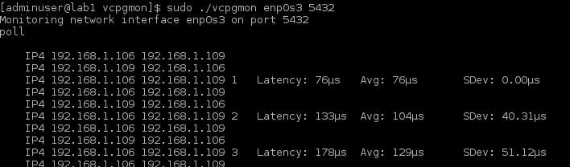
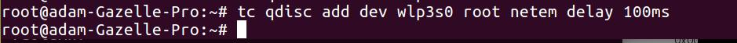
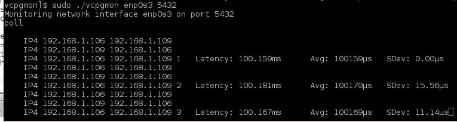

# vcpgmon

## Proof of Concept/Demo
If you wanted to find out the network latency between your client and PostgreSQL server, you could pull up wireshark (and have it installed, if approved) and then dig into some analysis.  But what if there were an easier tool, just for Postgres?

We demonstrate inferring network latency from client to PostgreSQL server written in golang.  Utilizes *pcap*
but *pfring* is preferable due to its performance.  *pfring* is not available on all systems.

NOTE: You need root access to listen in on packets.  For this version of our tool we require a quiet system with only 1 client talking to the server.


###Given:
1. PostgreSQL Client sends a query to the Server
2. Server Returns back Row description, Data Row, Command completion, and
   Ready for query messages (see https://www.postgresql.org/docs/9.5/static/protocol-message-formats.html for detail on the     protocol)
3. Then we receive a tcp ACK packet back from the Client                                .
```
The time delta between 1 and 2 can be used for measuring the sum of:
   Ts = Time to send packet to server
   Te = Time for server to execute Query
   Tr1 =Time for server to send first packet back with results

Between 2 and 3 we have:
   Tc1 = Time for server to send 1 or more packets to client
   Ta = Time for client to send back a tcp ACK
```
Say we use a mimimal query to send from the Client to the Server.
`
    Select 1;
`
Then,  #1, #2, and #3 can be completed in one packet each.  **Tc1** includes the network travel time **and** the OS time to generate a network packet.  So it's not a pure measure as though you were measuring at a router.  But you can use this tool to **compare network latency between other systems** Just keep in mind we are assuming that OS time to generate a network packet is the same between your systems.

##Example Run

You must run as root hence the sudo.  We listen on the network interface named enp0s3 over port 5432. (use sudo ifconfig -a to list your interfaces).   

Eace `Select 1;` generated 3 packets.  And we have 3 select tests here.  We display the source and destination IP address for each packet.  And when the tool detects a  tcp ACK packet (that doesn't have Application layer data, the same as saying there are no PostgreSQL protocol messages), it subtracts its time from the prior packet time.

The first test yields a latency of 76 microseconds (µs).  We keep a running average (76µs first trial) and a sample standard deviation (0.00µs first trial) as well.  There will alwys be variance.  In our test here this is performed on a Virtual Box CentOS 7 server running on top of Ubuntu acting as the client.

Next test, let's add a network delay on the client using the `tc`, traffic control command.

.

We run another 3 more Selects.



And we successfully measured the artifically induced, additional 100ms latency.  

NOTE: Don't forget to undo your tc command if you used it to add delay as in our example.
ex: ```tc qdisc del dev wlp3s0 root```

#Other notes
* We can create a tcpdump command and an awk command to perform a similar operation without the need for Golang.  This tool is for a larger project for monitoring.
* The further your client is away from your server in physical space, the higher the latency will be.  
* If you run 100 queries to do one user interaction on your application, a 100 ms increase in latency adds (100ms x 100) **10 seconds** to your response time!

